  

# 💰 Awesome Cash Flow Management 🚀

  
  
  
  
  

---

## 🌟 Top Cash Flow Management Platforms Ecosystem & Financial Tools

> **Curated List of Commercial SaaS Products & Open-Source GitHub Projects for Cash Forecasting, Liquidity Planning, Scenario Analysis & Working Capital Optimization.**

**Last updated: September 2026** 📅

Welcome to the **Awesome Cash Flow Management** repository! This curated sitemap and directory tracks leading **SaaS platforms** and **open-source financial software** for modern **cash flow management**, **runway modeling**, and **treasury forecasting**. Designed specifically for founders, CFOs, financial planning and analysis (FP&A) teams, accountants, and software developers building financial engines.

---

## 📑 Table of Contents
- [📊 Market Overview & Industry Dynamics](#-market-overview--industry-dynamics)
- [🏢 SaaS / Commercial Hosted Platforms](#-saas--commercial-hosted-platforms)
- [💻 Open-Source GitHub Projects](#-open-source-github-projects)
- [🤝 How to Contribute](#-how-to-contribute)
- [❤️ Support & Sponsorship](#%EF%B8%8F-support--sponsorship)
- [📈 Star History](#-star-history)
- [⚠️ Disclaimer](#%EF%B8%8F-disclaimer)

---

## 📊 Market Overview & Industry Dynamics

> **Estimated Market Size & Industry Structure:**  
> The global cash flow management and liquidity forecasting software market is estimated at **$1.8 Billion – $2.4 Billion (2026)**, expanding at a CAGR of ~13.5%. The market is **moderately fragmented**: enterprise treasury solutions (e.g., Kyriba, HighRadius) serve large corporations, while mid-market and SMB segments feature specialized FP&A and cash-forecasting SaaS platforms alongside a fast-growing open-source developer ecosystem.

---

## 🏢 SaaS / Commercial Hosted Platforms

Below is a detailed comparison of top commercial cash flow management and FP&A SaaS platforms, ordered by company size (estimated revenue / valuation, descending).

| 🏢 Platform | 📝 Overview & Core Capabilities | 💰 Pricing (Starting Tier) | 🎁 Free Tier / Free Trial Limits | 📈 Company Size (Revenue / Valuation) |
| :--- | :--- | :--- | :--- | :--- |
| **[Agicap](https://agicap.com/)** 🇫🇷 | European leader in automated cash flow management, bank aggregation, multi-entity treasury visibility, and runway modeling. | $166/month (€150/mo minimum custom package) | 7-Day Free Trial (Full feature access with sample data & bank sync demo) | **~$60M ARR / $500M+ Valuation** |
| **[Cube](https://www.cubesoftware.com/)** 🇺🇸 | Spreadsheet-native (Excel & Google Sheets) FP&A platform connecting ERPs to real-time financial models and cash forecasts. | $1,250/month (Premium tier billed annually) | 14-Day Guided Sandbox Trial (Sales-assisted live data preview) | **~$25M ARR / $150M Valuation** |
| **[Fathom](https://www.fathomhq.com/)** 🇦🇺 | Financial analysis, visual reporting dashboards, consolidated cash flow forecasting, and KPI benchmarking for advisory firms. | $55/month (Single entity plan) | 14-Day Free Trial (No credit card required, up to 5 entities) | **~$20M ARR / $100M Valuation** |
| **[Jirav](https://www.jirav.com/)** 🇺🇸 | Driver-based financial planning, workforce budgeting, dynamic revenue modeling, and automated cash flow forecasting. | $500/month (Starter plan billed annually) | 14-Day Free Trial (Full access to core modeling features) | **~$12M ARR / $60M Valuation** |
| **[Float](https://floatapp.com/)** 🇬🇧 | Real-time visual cash flow forecasting directly integrated with Xero, QuickBooks Online, and FreeAgent. | $69/month (Essential plan billed annually) | 14-Day Free Trial (No credit card required, unlimited bank connections) | **~$8M ARR / $40M Valuation** |
| **[PlanGuru](https://www.planguru.com/)** 🇺🇸 | Budgeting, 3-statement financial modeling, break-even analysis, and 12-month to 10-year cash flow projections. | $99/month (Basic plan, $899 billed annually) | 14-Day Free Trial (Full desktop or web access with sample datasets) | **~$6M ARR / $25M Valuation** |
| **[Dryrun](https://www.dryrun.com/)** 🇨🇦 | Multi-scenario cash flow modeling, customer invoice tracking, payment risk scoring, and working capital forecasting. | $199/month (Standard plan billed annually) | 14-Day Free Trial (No credit card required, 3 scenario models) | **~$4M ARR / $20M Valuation** |
| **[Pulse](https://www.pulseapp.com/)** 🇺🇸 | Lightweight cash flow management app for startups and small businesses tracking income, expenses, and liquidity. | $29/month (Basics tier) | 30-Day Free Trial (Credit card required upfront, full feature set) | **~$2M ARR / $10M Valuation** |
| **[CashFlow Frog](https://www.cashflowfrog.com/)** 🇮🇱 | Automated cash flow forecasting, customer payment behavior analytics, branded customer portals, and planned transaction modeling. | $41/month (Standard SMB plan billed annually) | 14-Day Free Trial (No credit card required, 1 organization sync) | **~$2M ARR / $10M Valuation** |
| **[Fluidly](https://fluidly.com/)** 🇬🇧 | Automated cash flow forecasting and intelligent invoice collection engine (integrated within digital accounting suites). | $15/month (£12/mo starter module) | 14-Day Free Trial (Basic cash forecast sync & invoice tracking) | **~$2M ARR / Acquisition by OakNorth** |

---

## 💻 Open-Source GitHub Projects

The open-source cash flow ecosystem features self-hosted double-entry bookkeeping ledgers, ML-powered forecasting frameworks, terminal-first CLIs, and quantum-inspired payment scheduling engines.

Repositories are ordered by **GitHub Stars_Count (Descending)** 🌟.

| 🛠️ Repository | ⭐ GitHub_Stars | 📜 License | 🧰 Tech Stack | 📌 Core Capabilities & Highlights |
| :--- | :--- | :--- | :--- | :--- |
| **[Actual Budget](https://github.com/actualbudget/actual)** |  | `MIT` | Node.js, React, SQLite | **Local-first, privacy-focused envelope budgeting & cash flow app.** Zero cloud lock-in, end-to-end encryption, multi-device sync, and bank feeds via GoCardless/SimpleFIN. |
| **[Firefly III](https://github.com/firefly-iii/firefly-iii)** |  | `AGPL-3.0` | PHP, Laravel, Docker | **Self-hosted double-entry financial manager with cash flow views.** Automated rule engine, multi-currency support, REST API, recurring transaction schedules, and budget tracking. |
| **[Invoice Ninja](https://github.com/invoiceninja/invoiceninja)** |  | `AEL-1.0` | PHP, Flutter, Vue.js | **Open-source invoicing, expense tracking & cash flow platform.** Invoicing, client portals, automated recurring payments, expense tracking, and real-time cash reports. |
| **[Akaunting](https://github.com/akaunting/akaunting)** |  | `GPL-3.0` | PHP, Laravel, Vue.js | **Free online accounting software designed for small businesses.** Multi-entity management, cash flow statements, vendor expense management, and client invoicing. |
| **[Money Manager Ex](https://github.com/moneymanagerex/moneymanagerex)** |  | `GPL-2.0` | C++, wxWidgets, SQLite | **Cross-platform desktop personal finance & cash forecasting.** Non-proprietary SQLite storage, AES encryption, USB portable execution, recurring bill forecasting, and graph reports. |
| **[GNUCash](https://github.com/Gnucash/gnucash)** |  | `GPL-3.0` | C, Scheme, GTK | **Professional accounting software with cash flow reporting.** Double-entry accounting ledger, scheduled transactions, financial calculations, and cash reconciliation. |
| **[cfo-cli](https://github.com/Neskys/cfo-cli)** |  | `MIT` | Python, SQLite, MCP | **Terminal-first financial CLI & AI cash flow forecaster.** Multi-scenario projections (optimist/pessimist), MCP server integration for LLM agents, local SQLite database, and multi-currency support. |
| **[Equilibrium](https://github.com/mtahakeles/equilibrium)** |  | `MIT` | JavaScript, Canvas | **Quantum-inspired payment scheduler for cash flow optimization.** Uses QUBO-style cost functions and Simulated Annealing to schedule bills while maintaining safety cash buffers. |
| **[Econumo](https://github.com/econumo/econumo)** |  | `MIT` | Go, Vue.js, SQLite | **Self-hosted envelope budgeting app with REST API.** Multi-user household sharing, PWA support, envelope allocation, and automated CSV import parsers. |
| **[pycashflow](https://github.com/H3-Consulting/pycashflow)** |  | `MIT` | Python, Flask, PostgreSQL | **REST API engine for 90-day cash flow projections.** Running-balance calculation, what-if risk scoring, Plaid bank synchronization, and exact Decimal string arithmetic. |
| **[AFIS Framework](https://github.com/afild/AFIS)** |  | `MIT` | Python, FastAPI, scikit-learn | **AI-driven financial intelligence & 12-month ML cash forecaster.** Ridge regression cash projections with 95% confidence intervals, NIST AI RMF governance audit trail, and offline LLM heuristics. |
| **[financial-modeling](https://github.com/77it/financial-modeling)** |  | `MIT` | JavaScript, Node.js | **Lightweight JS financial modeling and cash flow library.** Discounted cash flow (DCF), valuation ratios, statement bridges, and forecast schedule generators. |
| **[cash-flow-forecaster Skill](https://skillsmp.com/zh/creators/miketreml/missioncontrol/library-business-finance-accounting-skills-cash-flow-forecaster)** |  | `Custom` | AI Prompt / Spec | **Autonomous AI Agent Skill for CFO treasury modeling.** Direct/indirect forecasting methods, DSO/DPO working capital optimization, and bank liquidity stress testing. |

---

## 🤝 How to Contribute

Contributions are warmly welcomed! 💖

1. **Fork** the repository 🍴
2. **Create** a feature branch (`git checkout -b feature/new-tool`) 🌿
3. **Add** your tool or project to `README.md` keeping formatting consistent 📝
4. **Open** a Pull Request with a clear summary of your changes 🚀

---

## ❤️ Support & Sponsorship

If you find this curated cash flow management ecosystem list helpful, please consider supporting the project! 🌟

- ⭐ **Star** this repository to increase visibility.
- 🔄 **Fork** and share with fellow founders, CFOs, and engineers.
- ☕ **Buy me a coffee / Sponsor**: Support ongoing maintenance on the [GitHub Sponsor Dashboard](https://github.com/sponsors/ishandutta2007).

---

## 📈 Star History

---

## ⚠️ Disclaimer

- This list is **community-curated** for educational, evaluation, and research purposes.
- Commercial trademarks and product names belong to their respective corporate entities.
- Financial systems process sensitive payment and ledger data; always verify compliance with security standards (SOC 2, GDPR, ISO 27001) before deployment.

---

  <b>Built with ❤️ for CFOs, Finance Teams, Startup Founders & Open-Source Developers.</b>

